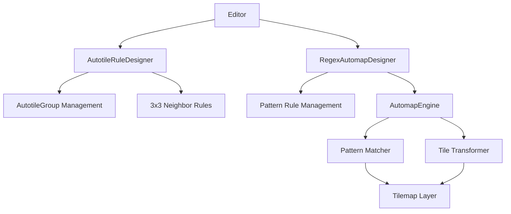
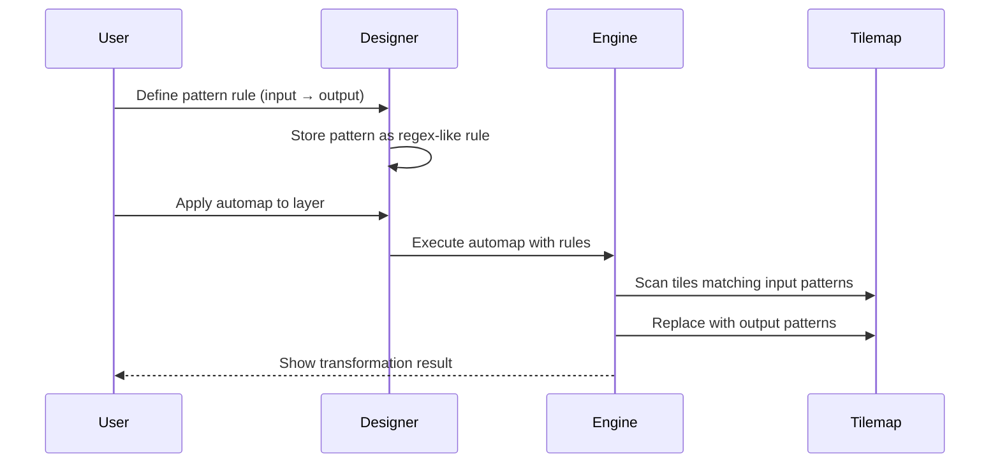

# Design Document: Autotile UX Improvements and Regex Automap

## Overview

This design addresses three key improvements to the tilemap editor's autotiling system: (1) improving the scrollable rules container with proper visual hints, (2) making autotile groups fully renameable with better UX feedback, and (3) adding a powerful regex-based automap feature that works independently from the existing 3x3 neighbor autotiling system. The regex automap will allow users to define pattern-based tile replacement rules using visual pattern icons similar to Tiled editor's automap functionality.

## Architecture

The system consists of three main components: the enhanced AutotileRuleDesigner with improved scrolling UX, the new RegexAutomapDesigner for pattern-based mapping, and the AutomapEngine that processes regex patterns to transform tile layouts.



## Main Algorithm/Workflow




## Components and Interfaces

### Component 1: Enhanced AutotileRuleDesigner

**Purpose**: Improve UX for the existing autotile designer with scrollable rule lists and better group management.

**Interface**:
```python
class AutotileRuleDesigner:
    def __init__(self, editor: "Editor", x: int, y: int):
        self.scroll_offset: int = 0
        self.max_visible_rules: int = 10
        self.scroll_bar_rect: Rect = None
        self.is_scrolling: bool = False
        
    def _draw_scrollable_rule_list(self, screen: Surface) -> None:
        """Draw rules with scroll indicators and scrollbar"""
        pass
    
    def _handle_scroll_event(self, event) -> bool:
        """Handle mouse wheel and scrollbar dragging"""
        pass
    
    def _draw_scroll_hints(self, screen: Surface) -> None:
        """Draw visual hints (arrows, fade effects) indicating scrollability"""
        pass
    
    def _handle_group_rename(self, event) -> bool:
        """Handle F2 key and inline text editing for group names"""
        pass
    
    def _create_new_group_with_focus(self) -> None:
        """Create new group and immediately enter rename mode"""
        pass
```

**Responsibilities**:
- Render scrollable rule lists with visual overflow indicators
- Handle scroll events (mouse wheel, scrollbar dragging)
- Manage group renaming with inline editing
- Provide immediate feedback when creating new groups

### Component 2: RegexAutomapDesigner

**Purpose**: Provide a separate UI for defining and managing regex-like pattern rules for automap transformations.

**Interface**:
```python
class RegexAutomapDesigner:
    def __init__(self, editor: "Editor", x: int, y: int):
        self.visible: bool = False
        self.pattern_rules: List[PatternRule] = []
        self.selected_rule_idx: int = -1
        self.input_pattern_grid: PatternGrid = None
        self.output_pattern_grid: PatternGrid = None
        
    def show(self) -> None:
        """Display the automap designer window"""
        pass
    
    def hide(self) -> None:
        """Hide the automap designer window"""
        pass
    
    def handle_event(self, event) -> bool:
        """Process user input events"""
        pass
    
    def draw(self, screen: Surface) -> None:
        """Render the automap designer UI"""
        pass
    
    def apply_automap_to_layer(self, layer: Layer) -> None:
        """Execute all pattern rules on the specified layer"""
        pass
    
    def _save_pattern_rule(self) -> None:
        """Save current input/output pattern as a rule"""
        pass
    
    def _delete_pattern_rule(self, idx: int) -> None:
        """Remove a pattern rule"""
        pass
```

**Responsibilities**:
- Manage pattern rule creation and editing
- Provide dual-grid interface (input pattern → output pattern)
- Execute automap transformations on tilemap layers
- Persist pattern rules with project data


### Component 3: AutomapEngine

**Purpose**: Execute pattern matching and tile transformation based on regex-like pattern rules.

**Interface**:
```python
class AutomapEngine:
    def __init__(self, tilemap: Tilemap):
        self.tilemap: Tilemap = tilemap
        
    def apply_rules(self, layer: Layer, rules: List[PatternRule]) -> int:
        """Apply all pattern rules to layer, return number of transformations"""
        pass
    
    def match_pattern(self, layer: Layer, x: int, y: int, pattern: PatternGrid) -> bool:
        """Check if pattern matches at given position"""
        pass
    
    def apply_pattern(self, layer: Layer, x: int, y: int, pattern: PatternGrid) -> None:
        """Apply output pattern at given position"""
        pass
    
    def scan_layer(self, layer: Layer, pattern: PatternGrid) -> List[Tuple[int, int]]:
        """Find all positions where pattern matches"""
        pass
```

**Responsibilities**:
- Pattern matching with wildcard support
- Tile transformation based on matched patterns
- Efficient layer scanning for pattern detection
- Handle overlapping pattern matches

### Component 4: PatternGrid

**Purpose**: Represent a tile pattern with support for wildcards and special matching rules.

**Interface**:
```python
class PatternGrid:
    def __init__(self, width: int, height: int):
        self.width: int = width
        self.height: int = height
        self.cells: Dict[Tuple[int, int], PatternCell] = {}
        
    def set_cell(self, x: int, y: int, cell: PatternCell) -> None:
        """Set pattern cell at position"""
        pass
    
    def get_cell(self, x: int, y: int) -> Optional[PatternCell]:
        """Get pattern cell at position"""
        pass
    
    def matches(self, tiles: Dict[Tuple[int, int], int]) -> bool:
        """Check if tile data matches this pattern"""
        pass
    
    def to_dict(self) -> dict:
        """Serialize pattern to dictionary"""
        pass
    
    @staticmethod
    def from_dict(data: dict) -> "PatternGrid":
        """Deserialize pattern from dictionary"""
        pass
```

**Responsibilities**:
- Store pattern cell data with tile IDs and wildcards
- Perform pattern matching against actual tile data
- Support serialization for persistence


## Data Models

### Model 1: PatternCell

```python
@dataclass
class PatternCell:
    tile_id: Optional[int]  # None for wildcard
    tileset_index: Optional[int]
    match_mode: MatchMode  # EXACT, WILDCARD, ANY_FILLED, ANY_EMPTY
    
    def matches(self, actual_tile_id: Optional[int]) -> bool:
        """Check if actual tile matches this pattern cell"""
        if self.match_mode == MatchMode.WILDCARD:
            return True
        elif self.match_mode == MatchMode.ANY_FILLED:
            return actual_tile_id is not None
        elif self.match_mode == MatchMode.ANY_EMPTY:
            return actual_tile_id is None
        else:  # EXACT
            return self.tile_id == actual_tile_id
```

**Validation Rules**:
- tile_id must be valid tile index or None
- match_mode must be valid MatchMode enum value
- EXACT mode requires non-None tile_id

### Model 2: PatternRule

```python
@dataclass
class PatternRule:
    name: str
    input_pattern: PatternGrid
    output_pattern: PatternGrid
    enabled: bool = True
    priority: int = 0
    
    def to_dict(self) -> dict:
        return {
            "name": self.name,
            "input_pattern": self.input_pattern.to_dict(),
            "output_pattern": self.output_pattern.to_dict(),
            "enabled": self.enabled,
            "priority": self.priority,
        }
    
    @staticmethod
    def from_dict(data: dict) -> "PatternRule":
        return PatternRule(
            name=data["name"],
            input_pattern=PatternGrid.from_dict(data["input_pattern"]),
            output_pattern=PatternGrid.from_dict(data["output_pattern"]),
            enabled=data.get("enabled", True),
            priority=data.get("priority", 0),
        )
```

**Validation Rules**:
- name must be non-empty string
- input_pattern and output_pattern must have same dimensions
- priority must be non-negative integer

### Model 3: MatchMode (Enum)

```python
class MatchMode(Enum):
    EXACT = "exact"           # Match specific tile ID
    WILDCARD = "wildcard"     # Match any tile (including empty)
    ANY_FILLED = "any_filled" # Match any non-empty tile
    ANY_EMPTY = "any_empty"   # Match only empty tiles
```


## Key Functions with Formal Specifications

### Function 1: apply_rules()

```python
def apply_rules(self, layer: Layer, rules: List[PatternRule]) -> int:
    """Apply all enabled pattern rules to layer in priority order"""
    pass
```

**Preconditions:**
- layer is a valid Layer object with initialized tile data
- rules is a list of PatternRule objects
- layer dimensions are positive integers

**Postconditions:**
- Returns count of tile transformations applied (>= 0)
- Layer tile data is modified according to matched patterns
- Higher priority rules are applied first
- Disabled rules are skipped
- Original layer state is preserved if no patterns match

**Loop Invariants:**
- All processed rules maintain layer integrity (no out-of-bounds writes)
- Transformation count accurately reflects number of tile changes

### Function 2: match_pattern()

```python
def match_pattern(self, layer: Layer, x: int, y: int, pattern: PatternGrid) -> bool:
    """Check if pattern matches at given position in layer"""
    pass
```

**Preconditions:**
- layer is a valid Layer object
- x, y are integers representing layer coordinates
- pattern is a valid PatternGrid with width > 0 and height > 0
- Pattern cells have valid MatchMode values

**Postconditions:**
- Returns True if and only if all pattern cells match corresponding layer tiles
- Returns False if pattern extends beyond layer boundaries
- No modifications to layer or pattern data
- Wildcard cells always match

**Loop Invariants:**
- For each checked cell: match result is consistent with MatchMode
- Pattern bounds checking prevents out-of-bounds access

### Function 3: _draw_scrollable_rule_list()

```python
def _draw_scrollable_rule_list(self, screen: Surface) -> None:
    """Draw rules with scroll indicators and scrollbar"""
    pass
```

**Preconditions:**
- screen is a valid pygame Surface
- self.rule_list_area is a valid Rect
- self.scroll_offset is non-negative integer
- Font objects are initialized

**Postconditions:**
- Rules are rendered within rule_list_area bounds
- Only visible rules (based on scroll_offset) are drawn
- Scroll indicators appear when total rules > max_visible_rules
- Scrollbar position reflects current scroll_offset
- No rendering outside rule_list_area

**Loop Invariants:**
- Each rendered rule stays within its allocated rectangle
- Visible rule index = scroll_offset + iteration_index


## Algorithmic Pseudocode

### Main Automap Processing Algorithm

```python
def apply_automap_to_layer(layer: Layer, rules: List[PatternRule]) -> int:
    """
    Apply pattern-based automap rules to transform tiles in layer
    
    INPUT: layer (Layer object), rules (list of PatternRule objects)
    OUTPUT: transformation_count (integer >= 0)
    """
    # Precondition: layer is valid, rules is non-empty list
    assert layer is not None
    assert isinstance(rules, list)
    
    transformation_count = 0
    
    # Sort rules by priority (higher priority first)
    sorted_rules = sorted(
        [r for r in rules if r.enabled],
        key=lambda r: r.priority,
        reverse=True
    )
    
    # Apply each rule to the entire layer
    for rule in sorted_rules:
        # Loop invariant: transformation_count >= 0
        assert transformation_count >= 0
        
        # Find all matching positions for input pattern
        matches = scan_layer_for_pattern(layer, rule.input_pattern)
        
        # Apply output pattern at each match
        for x, y in matches:
            apply_pattern_at_position(layer, x, y, rule.output_pattern)
            transformation_count += 1
    
    # Postcondition: return value reflects actual transformations
    assert transformation_count >= 0
    return transformation_count


def scan_layer_for_pattern(layer: Layer, pattern: PatternGrid) -> List[Tuple[int, int]]:
    """
    Scan layer to find all positions where pattern matches
    
    INPUT: layer (Layer), pattern (PatternGrid)
    OUTPUT: list of (x, y) coordinate tuples
    """
    # Precondition: layer and pattern are valid
    assert layer is not None
    assert pattern.width > 0 and pattern.height > 0
    
    matches = []
    
    # Scan entire layer with pattern window
    for y in range(layer.height - pattern.height + 1):
        for x in range(layer.width - pattern.width + 1):
            # Loop invariant: all positions in matches are valid
            assert all(0 <= mx < layer.width and 0 <= my < layer.height 
                      for mx, my in matches)
            
            if match_pattern_at_position(layer, x, y, pattern):
                matches.append((x, y))
    
    # Postcondition: all returned positions are within layer bounds
    assert all(0 <= x < layer.width and 0 <= y < layer.height 
              for x, y in matches)
    return matches


def match_pattern_at_position(layer: Layer, x: int, y: int, pattern: PatternGrid) -> bool:
    """
    Check if pattern matches at specific position
    
    INPUT: layer (Layer), x (int), y (int), pattern (PatternGrid)
    OUTPUT: boolean indicating match
    """
    # Precondition: position is valid starting point
    assert 0 <= x < layer.width
    assert 0 <= y < layer.height
    
    # Check each cell in pattern
    for py in range(pattern.height):
        for px in range(pattern.width):
            # Loop invariant: we stay within layer bounds
            layer_x = x + px
            layer_y = y + py
            
            if layer_x >= layer.width or layer_y >= layer.height:
                return False
            
            pattern_cell = pattern.get_cell(px, py)
            layer_tile = layer.get_tile(layer_x, layer_y)
            
            if not pattern_cell.matches(layer_tile):
                return False
    
    # Postcondition: all cells matched
    return True


def apply_pattern_at_position(layer: Layer, x: int, y: int, pattern: PatternGrid) -> None:
    """
    Apply output pattern at specific position
    
    INPUT: layer (Layer), x (int), y (int), pattern (PatternGrid)
    OUTPUT: None (modifies layer in-place)
    """
    # Precondition: position is valid
    assert 0 <= x < layer.width
    assert 0 <= y < layer.height
    
    # Apply each cell in pattern
    for py in range(pattern.height):
        for px in range(pattern.width):
            # Loop invariant: we stay within layer bounds
            layer_x = x + px
            layer_y = y + py
            
            if layer_x < layer.width and layer_y < layer.height:
                pattern_cell = pattern.get_cell(px, py)
                
                # Only apply non-wildcard cells
                if pattern_cell.match_mode == MatchMode.EXACT:
                    layer.set_tile(layer_x, layer_y, pattern_cell.tile_id)
    
    # Postcondition: layer tiles updated within pattern bounds
```


### Scrollable Rule List Algorithm

```python
def handle_scroll_event(event) -> bool:
    """
    Handle mouse wheel and scrollbar interactions
    
    INPUT: event (pygame event)
    OUTPUT: boolean indicating if event was handled
    """
    # Precondition: event is valid pygame event
    assert event is not None
    
    if event.type == pygame.MOUSEWHEEL:
        # Scroll by mouse wheel
        scroll_delta = -event.y  # Negative for natural scrolling
        
        old_offset = self.scroll_offset
        self.scroll_offset = max(0, self.scroll_offset + scroll_delta)
        
        # Clamp to maximum scroll
        max_scroll = max(0, len(self.current_rules) - self.max_visible_rules)
        self.scroll_offset = min(self.scroll_offset, max_scroll)
        
        # Postcondition: scroll_offset is within valid range
        assert 0 <= self.scroll_offset <= max_scroll
        
        return old_offset != self.scroll_offset
    
    elif event.type == pygame.MOUSEBUTTONDOWN:
        if self.scroll_bar_rect and self.scroll_bar_rect.collidepoint(event.pos):
            self.is_scrolling = True
            return True
    
    elif event.type == pygame.MOUSEBUTTONUP:
        if self.is_scrolling:
            self.is_scrolling = False
            return True
    
    elif event.type == pygame.MOUSEMOTION:
        if self.is_scrolling:
            # Calculate scroll position from mouse Y
            relative_y = event.pos[1] - self.rule_list_area.y
            scroll_track_height = self.rule_list_area.height - 40
            
            scroll_ratio = relative_y / scroll_track_height
            max_scroll = max(0, len(self.current_rules) - self.max_visible_rules)
            
            self.scroll_offset = int(scroll_ratio * max_scroll)
            self.scroll_offset = max(0, min(self.scroll_offset, max_scroll))
            
            # Postcondition: scroll_offset is clamped
            assert 0 <= self.scroll_offset <= max_scroll
            
            return True
    
    return False


def draw_scrollable_rule_list(screen: Surface) -> None:
    """
    Render rules with scroll indicators
    
    INPUT: screen (pygame Surface)
    OUTPUT: None (draws to screen)
    """
    # Precondition: screen and fonts are initialized
    assert screen is not None
    assert self.font is not None
    
    total_rules = len(self.current_rules)
    max_scroll = max(0, total_rules - self.max_visible_rules)
    
    # Draw visible rules
    start_y = self.rule_list_area.y + 30
    item_height = 25
    
    visible_start = self.scroll_offset
    visible_end = min(visible_start + self.max_visible_rules, total_rules)
    
    for i in range(visible_start, visible_end):
        # Loop invariant: i is within valid rule index range
        assert 0 <= i < total_rules
        
        rule = self.current_rules[i]
        display_index = i - visible_start
        
        y_pos = start_y + display_index * item_height
        rect = Rect(self.rule_list_area.x + 5, y_pos, 
                   self.rule_list_area.width - 10, item_height)
        
        # Highlight selected rule
        if i == self.selected_rule_index:
            pygame.draw.rect(screen, HIGHLIGHT_COLOR, rect, border_radius=3)
        
        # Draw rule name
        text_surf = self.font.render(rule.name, True, TEXT_COLOR)
        screen.blit(text_surf, (rect.x + 5, rect.y + 5))
    
    # Draw scroll indicators if needed
    if total_rules > self.max_visible_rules:
        # Top fade/arrow if not at top
        if self.scroll_offset > 0:
            arrow_up = "▲"
            arrow_surf = self.font.render(arrow_up, True, (150, 200, 255))
            screen.blit(arrow_surf, 
                       (self.rule_list_area.right - 20, self.rule_list_area.y + 5))
        
        # Bottom fade/arrow if not at bottom
        if self.scroll_offset < max_scroll:
            arrow_down = "▼"
            arrow_surf = self.font.render(arrow_down, True, (150, 200, 255))
            screen.blit(arrow_surf, 
                       (self.rule_list_area.right - 20, self.rule_list_area.bottom - 35))
        
        # Draw scrollbar
        scrollbar_height = 60
        track_height = self.rule_list_area.height - 40
        scroll_ratio = self.scroll_offset / max_scroll if max_scroll > 0 else 0
        
        scrollbar_y = self.rule_list_area.y + 20 + int(scroll_ratio * (track_height - scrollbar_height))
        
        self.scroll_bar_rect = Rect(
            self.rule_list_area.right - 15,
            scrollbar_y,
            10,
            scrollbar_height
        )
        
        pygame.draw.rect(screen, (100, 100, 120), self.scroll_bar_rect, border_radius=5)
    
    # Postcondition: all drawing stayed within rule_list_area
```


### Group Rename Algorithm

```python
def handle_group_rename(event) -> bool:
    """
    Handle inline group name editing
    
    INPUT: event (pygame event)
    OUTPUT: boolean indicating if event was handled
    """
    # Precondition: event is valid
    assert event is not None
    
    if event.type == pygame.KEYDOWN:
        # F2 to start renaming selected group
        if event.key == pygame.K_F2 and self.selected_group_idx >= 0:
            self.renaming_group_idx = self.selected_group_idx
            self.rename_text = self.groups[self.selected_group_idx].name
            return True
        
        # Handle text input during rename
        if self.renaming_group_idx is not None:
            if event.key == pygame.K_RETURN:
                # Confirm rename
                group = self.groups[self.renaming_group_idx]
                old_name = group.name
                group.name = self.rename_text
                
                # Update all rules in this group
                for rule in group.rules:
                    rule.group_id = self.rename_text
                
                self.renaming_group_idx = None
                
                # Postcondition: group name updated
                assert group.name == self.rename_text
                return True
            
            elif event.key == pygame.K_ESCAPE:
                # Cancel rename
                self.renaming_group_idx = None
                return True
            
            elif event.key == pygame.K_BACKSPACE:
                # Delete character
                self.rename_text = self.rename_text[:-1]
                return True
            
            else:
                # Add character
                if event.unicode.isprintable():
                    self.rename_text += event.unicode
                return True
    
    return False


def create_new_group_with_focus() -> None:
    """
    Create new group and immediately enter rename mode
    
    INPUT: None
    OUTPUT: None (modifies self.groups)
    """
    # Precondition: groups list exists
    assert self.groups is not None
    
    # Create new group with default name
    new_group_name = f"Group {len(self.groups) + 1}"
    new_group = AutotileGroup(new_group_name)
    
    self.groups.append(new_group)
    self.selected_group_idx = len(self.groups) - 1
    self.selected_rule_index = -1
    
    # Immediately enter rename mode
    self.renaming_group_idx = self.selected_group_idx
    self.rename_text = new_group_name
    
    # Postcondition: new group created and rename mode active
    assert len(self.groups) > 0
    assert self.renaming_group_idx == self.selected_group_idx
    assert self.rename_text == new_group_name
```


## Example Usage

### Example 1: Scrolling through rules

```python
# User has 20 rules in current group, only 10 visible at once
designer = AutotileRuleDesigner(editor, 100, 100)
designer.max_visible_rules = 10
designer.show()

# User scrolls with mouse wheel
event = pygame.event.Event(pygame.MOUSEWHEEL, {"y": -1})
handled = designer.handle_event(event)
# designer.scroll_offset increases by 1

# User drags scrollbar
event_down = pygame.event.Event(pygame.MOUSEBUTTONDOWN, 
                                {"pos": designer.scroll_bar_rect.center, "button": 1})
designer.handle_event(event_down)
# designer.is_scrolling = True

event_motion = pygame.event.Event(pygame.MOUSEMOTION, 
                                  {"pos": (designer.scroll_bar_rect.x, 300)})
designer.handle_event(event_motion)
# designer.scroll_offset updates based on mouse position
```

### Example 2: Renaming a group

```python
# User selects a group and presses F2
designer.selected_group_idx = 0
event_f2 = pygame.event.Event(pygame.KEYDOWN, {"key": pygame.K_F2})
designer.handle_event(event_f2)
# designer.renaming_group_idx = 0
# designer.rename_text = "Default"

# User types new name
for char in "Terrain":
    event_char = pygame.event.Event(pygame.KEYDOWN, {"unicode": char})
    designer.handle_event(event_char)
# designer.rename_text = "Terrain"

# User presses Enter to confirm
event_enter = pygame.event.Event(pygame.KEYDOWN, {"key": pygame.K_RETURN})
designer.handle_event(event_enter)
# designer.groups[0].name = "Terrain"
# All rules in group have group_id = "Terrain"
```

### Example 3: Creating new group with immediate rename

```python
# User clicks "New Group" button
designer._create_new_group_with_focus()
# New group created: "Group 2"
# designer.renaming_group_idx = 1 (immediately in rename mode)
# designer.rename_text = "Group 2"

# User can immediately start typing without pressing F2
event_char = pygame.event.Event(pygame.KEYDOWN, {"unicode": "W"})
designer.handle_event(event_char)
# designer.rename_text = "Group 2W"
```

### Example 4: Creating a pattern rule for automap

```python
# User opens regex automap designer
automap_designer = RegexAutomapDesigner(editor, 150, 150)
automap_designer.show()

# User defines input pattern (3x3 grid)
# Pattern: grass tiles in L-shape should become path tiles
input_pattern = PatternGrid(3, 3)
input_pattern.set_cell(0, 0, PatternCell(tile_id=5, match_mode=MatchMode.EXACT))  # grass
input_pattern.set_cell(0, 1, PatternCell(tile_id=5, match_mode=MatchMode.EXACT))  # grass
input_pattern.set_cell(1, 1, PatternCell(tile_id=5, match_mode=MatchMode.EXACT))  # grass
input_pattern.set_cell(1, 0, PatternCell(match_mode=MatchMode.WILDCARD))  # any
input_pattern.set_cell(2, 0, PatternCell(match_mode=MatchMode.WILDCARD))  # any
input_pattern.set_cell(0, 2, PatternCell(match_mode=MatchMode.WILDCARD))  # any
input_pattern.set_cell(1, 2, PatternCell(match_mode=MatchMode.WILDCARD))  # any
input_pattern.set_cell(2, 1, PatternCell(match_mode=MatchMode.WILDCARD))  # any
input_pattern.set_cell(2, 2, PatternCell(match_mode=MatchMode.WILDCARD))  # any

# User defines output pattern
output_pattern = PatternGrid(3, 3)
output_pattern.set_cell(0, 0, PatternCell(tile_id=12, match_mode=MatchMode.EXACT))  # path
output_pattern.set_cell(0, 1, PatternCell(tile_id=12, match_mode=MatchMode.EXACT))  # path
output_pattern.set_cell(1, 1, PatternCell(tile_id=12, match_mode=MatchMode.EXACT))  # path
# Other cells remain as wildcards (unchanged)

# Save the rule
rule = PatternRule(
    name="Grass L-Shape to Path",
    input_pattern=input_pattern,
    output_pattern=output_pattern,
    priority=10
)
automap_designer.pattern_rules.append(rule)
```

### Example 5: Applying automap to layer

```python
# User applies automap to active layer
layer = editor.tilemap.layer_manager.get_active_layer()
engine = AutomapEngine(editor.tilemap)

# Apply all pattern rules
transformation_count = engine.apply_rules(layer, automap_designer.pattern_rules)
print(f"Applied {transformation_count} tile transformations")

# Result: All L-shaped grass patterns are converted to path tiles
```


## Correctness Properties

*A property is a characteristic or behavior that should hold true across all valid executions of a system-essentially, a formal statement about what the system should do. Properties serve as the bridge between human-readable specifications and machine-verifiable correctness guarantees.*

### Property 1: Scroll Bounds Integrity

*For any* AutotileRuleDesigner with any number of rules and any scroll operation, the scroll offset should remain within valid bounds (0 to max_scroll).

**Validates: Requirements 1.4, 2.1, 2.2, 2.3, 2.4**

### Property 2: Scrollbar Visibility

*For any* AutotileRuleDesigner, when the number of rules exceeds the maximum visible count, a scrollbar should be displayed.

**Validates: Requirements 1.1**

### Property 3: Scroll Indicator Display

*For any* AutotileRuleDesigner, upward arrows should appear when scroll offset > 0, and downward arrows should appear when scroll offset < max_scroll.

**Validates: Requirements 1.2, 1.3, 17.3**

### Property 4: Scrollbar Position Mapping

*For any* scrollbar drag position, the calculated scroll offset should correctly map to the visible rules range.

**Validates: Requirements 1.5**

### Property 5: Visible Rules Calculation

*For any* AutotileRuleDesigner with any scroll offset, only the rules in the range [scroll_offset, scroll_offset + max_visible_rules] should be rendered.

**Validates: Requirements 1.6**

### Property 6: Rename Mode Activation

*For any* selected group, pressing F2 should enter rename mode with the current group name as the initial text.

**Validates: Requirements 3.1, 3.2**

### Property 7: Rename Text Input

*For any* printable character typed in rename mode, the character should be appended to the rename text.

**Validates: Requirements 3.3**

### Property 8: Rename Backspace Handling

*For any* rename text, pressing backspace should remove the last character.

**Validates: Requirements 3.4**

### Property 9: Rename Confirmation

*For any* rename text, pressing Enter should save the new group name and exit rename mode.

**Validates: Requirements 3.5**

### Property 10: Rename Cancellation

*For any* group in rename mode, pressing Escape should restore the original name and exit rename mode.

**Validates: Requirements 3.6**

### Property 11: Group Name Synchronization

*For any* group that is renamed, all rules in that group should have their group_id updated to the new name.

**Validates: Requirements 3.7**

### Property 12: New Group Creation

*For any* new group creation, the group should have a non-empty default name, be selected, and immediately enter rename mode.

**Validates: Requirements 4.1, 4.2, 4.3**

### Property 13: Wildcard Match Behavior

*For any* pattern cell with WILDCARD match mode and any tile ID (including None), the cell should match.

**Validates: Requirements 5.6**

### Property 14: Exact Match Behavior

*For any* pattern cell with EXACT match mode, the cell should match only the specified tile ID.

**Validates: Requirements 5.7**

### Property 15: Filled Match Behavior

*For any* pattern cell with ANY_FILLED match mode, the cell should match any non-None tile ID.

**Validates: Requirements 5.8**

### Property 16: Empty Match Behavior

*For any* pattern cell with ANY_EMPTY match mode, the cell should match only None tile ID.

**Validates: Requirements 5.9**

### Property 17: Pattern Dimension Consistency

*For any* pattern rule, the input pattern and output pattern should have identical width and height.

**Validates: Requirements 6.3**

### Property 18: Pattern Rule Serialization Round-Trip

*For any* valid pattern rule, serializing then deserializing should produce an equivalent rule.

**Validates: Requirements 6.4, 12.3**

### Property 19: Empty Rule Name Rejection

*For any* pattern rule with an empty name, the system should prevent saving the rule.

**Validates: Requirements 6.6**

### Property 20: Pattern Grid Serialization Round-Trip

*For any* valid pattern grid, serializing then deserializing should produce an equivalent grid.

**Validates: Requirements 12.1**

### Property 21: Rule List Addition

*For any* pattern rule that is saved, the rule should appear in the pattern rules list.

**Validates: Requirements 7.6**

### Property 22: Rule List Removal

*For any* pattern rule that is deleted, the rule should be removed from the pattern rules list.

**Validates: Requirements 7.7**

### Property 23: Rule Selection Loading

*For any* pattern rule that is selected, its input and output patterns should be loaded into the respective grids.

**Validates: Requirements 7.9**

### Property 24: Pattern Boundary Rejection

*For any* pattern that would extend beyond layer boundaries, the match should return false.

**Validates: Requirements 8.2**

### Property 25: Pattern Match Consistency

*For any* layer position where a pattern matches, all individual pattern cells should match their corresponding layer tiles.

**Validates: Requirements 8.3**

### Property 26: Pattern Scan Completeness

*For any* layer and pattern, scanning should find all positions where the pattern matches.

**Validates: Requirements 8.5**

### Property 27: Pattern Application Correctness

*For any* output pattern applied at a position, tiles should be set according to EXACT match mode cells.

**Validates: Requirements 9.1**

### Property 28: Wildcard Preservation

*For any* output pattern with WILDCARD cells, those positions should not modify the layer tiles.

**Validates: Requirements 9.2**

### Property 29: Pattern Application Bounds Safety

*For any* pattern application, all tile modifications should stay within layer boundaries.

**Validates: Requirements 9.4**

### Property 30: Rule Priority Ordering

*For any* list of rules applied to a layer, rules should be processed in descending priority order.

**Validates: Requirements 10.1**

### Property 31: Disabled Rule Skipping

*For any* disabled rule in a rule list, the rule should not affect the layer.

**Validates: Requirements 10.3**

### Property 32: Transformation Count Accuracy

*For any* automap execution, the returned transformation count should equal the number of tiles actually modified.

**Validates: Requirements 10.4**

### Property 33: Empty Pattern Rejection

*For any* pattern rule with no cells defined, the system should prevent saving the rule.

**Validates: Requirements 13.3**

### Property 34: Duplicate Group Name Resolution

*For any* group renamed to an existing name, the system should append a numeric suffix to make it unique.

**Validates: Requirements 14.1**

### Property 35: Transformation Limit Enforcement

*For any* automap execution, the total number of transformations should not exceed the configured maximum limit.

**Validates: Requirements 15.1**

### Property 36: Autotile Data Isolation

*For any* automap execution on a layer, autotile rules and groups should remain unchanged.

**Validates: Requirements 16.2**

### Property 37: Automap Data Isolation

*For any* autotile execution on a layer, automap pattern rules should remain unchanged.

**Validates: Requirements 16.3**

### Property 38: Rename Mode Exit

*For any* rename mode that is exited (via Enter or Escape), the designer should return to normal display mode.

**Validates: Requirements 18.4**

### Property 39: Sparse Grid Default Wildcard

*For any* pattern grid cell that is queried but not explicitly set, a default wildcard cell should be returned.

**Validates: Requirements 19.3**

### Property 40: Dimension Validation

*For any* pattern rule deserialization with non-positive dimensions, validation should fail with an exception.

**Validates: Requirements 20.1**

### Property 41: Tile ID Validation

*For any* pattern rule deserialization with invalid tile IDs, validation should fail with an exception.

**Validates: Requirements 20.2**

### Property 42: Match Mode Validation

*For any* pattern rule deserialization with invalid match modes, validation should fail with an exception.

**Validates: Requirements 20.3**

### Property 43: Priority Validation

*For any* pattern rule deserialization with negative priority, validation should fail with an exception.

**Validates: Requirements 20.4**


## Error Handling

### Error Scenario 1: Pattern Extends Beyond Layer Bounds

**Condition**: User attempts to apply a pattern that would extend beyond layer boundaries
**Response**: Pattern matching returns False, no transformation applied
**Recovery**: System continues checking other positions; user can adjust pattern size or layer size

### Error Scenario 2: Invalid Tile ID in Pattern

**Condition**: Pattern cell references a tile_id that doesn't exist in the tileset
**Response**: Log warning, skip that specific cell during application
**Recovery**: Other valid cells in pattern are still applied; user notified via status message

### Error Scenario 3: Empty Pattern Rule

**Condition**: User attempts to save a pattern rule with no cells defined
**Response**: Display error message "Pattern cannot be empty", prevent save
**Recovery**: User must define at least one cell in input pattern before saving

### Error Scenario 4: Duplicate Group Names

**Condition**: User renames a group to a name that already exists
**Response**: Append numeric suffix to make name unique (e.g., "Terrain" → "Terrain 2")
**Recovery**: Automatic resolution, user can rename again if desired

### Error Scenario 5: Scroll Offset Out of Bounds

**Condition**: Rules are deleted while scrolled down, causing scroll_offset to exceed new maximum
**Response**: Automatically clamp scroll_offset to valid range: `min(scroll_offset, max_scroll)`
**Recovery**: Immediate correction, no user action required

### Error Scenario 6: Pattern Serialization Failure

**Condition**: Error occurs while saving pattern rules to project file
**Response**: Display error dialog with details, keep rules in memory
**Recovery**: User can retry save or export rules to separate file

### Error Scenario 7: Circular Pattern Dependencies

**Condition**: Output pattern of one rule matches input pattern of another, creating infinite loop
**Response**: Limit total transformations per apply_rules call to prevent infinite loops
**Recovery**: Stop after max_transformations (e.g., 10,000), notify user of potential circular dependency

### Error Scenario 8: Missing Tileset Reference

**Condition**: Pattern rule references a tileset that is no longer loaded
**Response**: Display rule with warning icon, disable rule automatically
**Recovery**: User can update rule with new tileset or delete rule


## Testing Strategy

### Unit Testing Approach

**Core Pattern Matching Tests**:
- Test PatternCell.matches() with all MatchMode values
- Test PatternGrid.matches() with various tile configurations
- Test match_pattern_at_position() with edge cases (boundaries, empty tiles)
- Test wildcard matching behavior

**Scroll Functionality Tests**:
- Test scroll_offset clamping with various rule counts
- Test mouse wheel scrolling increments
- Test scrollbar dragging calculations
- Test scroll position after rule deletion
- Test scroll indicators visibility logic

**Group Management Tests**:
- Test group creation and selection
- Test group renaming with F2 key
- Test rename text input handling (backspace, escape, enter)
- Test group_id synchronization across rules
- Test duplicate name handling

**Pattern Application Tests**:
- Test apply_pattern_at_position() with various patterns
- Test scan_layer_for_pattern() finds all matches
- Test apply_rules() respects priority ordering
- Test transformation count accuracy
- Test disabled rules are skipped

**Boundary Tests**:
- Test patterns at layer edges
- Test patterns larger than layer
- Test empty layers
- Test single-cell patterns

### Property-Based Testing Approach

**Property Test Library**: Hypothesis (Python)

**Property Test 1: Scroll Bounds Invariant**
```python
@given(
    rule_count=st.integers(min_value=0, max_value=100),
    max_visible=st.integers(min_value=1, max_value=20),
    scroll_delta=st.integers(min_value=-10, max_value=10)
)
def test_scroll_bounds_invariant(rule_count, max_visible, scroll_delta):
    designer = create_designer_with_rules(rule_count)
    designer.max_visible_rules = max_visible
    
    initial_offset = designer.scroll_offset
    designer.scroll_offset = max(0, initial_offset + scroll_delta)
    
    max_scroll = max(0, rule_count - max_visible)
    designer.scroll_offset = min(designer.scroll_offset, max_scroll)
    
    assert 0 <= designer.scroll_offset <= max_scroll
```

**Property Test 2: Pattern Match Symmetry**
```python
@given(
    pattern_size=st.tuples(st.integers(1, 5), st.integers(1, 5)),
    layer_size=st.tuples(st.integers(5, 20), st.integers(5, 20)),
    position=st.tuples(st.integers(0, 15), st.integers(0, 15))
)
def test_pattern_match_symmetry(pattern_size, layer_size, position):
    pattern = create_random_pattern(*pattern_size)
    layer = create_layer(*layer_size)
    x, y = position
    
    # If pattern matches, applying and re-checking should still match
    if match_pattern_at_position(layer, x, y, pattern):
        apply_pattern_at_position(layer, x, y, pattern)
        assert match_pattern_at_position(layer, x, y, pattern)
```

**Property Test 3: Transformation Idempotence**
```python
@given(
    layer_data=st.lists(st.lists(st.integers(0, 50), min_size=5, max_size=10), 
                       min_size=5, max_size=10),
    rules=st.lists(pattern_rule_strategy(), min_size=1, max_size=5)
)
def test_transformation_idempotence(layer_data, rules):
    layer = Layer.from_data(layer_data)
    engine = AutomapEngine(None)
    
    # Apply rules once
    count1 = engine.apply_rules(layer, rules)
    layer_state1 = layer.to_dict()
    
    # Apply rules again
    count2 = engine.apply_rules(layer, rules)
    layer_state2 = layer.to_dict()
    
    # If no changes on second application, rules are idempotent
    if count2 == 0:
        assert layer_state1 == layer_state2
```

**Property Test 4: Group Rename Consistency**
```python
@given(
    group_count=st.integers(min_value=1, max_value=10),
    group_idx=st.integers(min_value=0, max_value=9),
    new_name=st.text(min_size=1, max_size=20)
)
def test_group_rename_consistency(group_count, group_idx, new_name):
    assume(group_idx < group_count)
    
    designer = create_designer_with_groups(group_count)
    group = designer.groups[group_idx]
    
    # Add some rules to the group
    for i in range(3):
        rule = create_test_rule(f"Rule {i}")
        rule.group_id = group.name
        group.rules.append(rule)
    
    # Rename group
    old_name = group.name
    group.name = new_name
    for rule in group.rules:
        rule.group_id = new_name
    
    # All rules should have updated group_id
    assert all(rule.group_id == new_name for rule in group.rules)
```

### Integration Testing Approach

**Integration Test 1: End-to-End Automap Workflow**
- Create RegexAutomapDesigner
- Define multiple pattern rules with different priorities
- Apply to a test layer with known tile configuration
- Verify expected transformations occurred
- Verify transformation count matches expected

**Integration Test 2: Autotile Designer with Scrolling**
- Create AutotileRuleDesigner with 30 rules
- Simulate mouse wheel scrolling
- Verify correct rules are visible
- Click on a rule that requires scrolling to see
- Verify rule loads correctly into editor

**Integration Test 3: Group Management Workflow**
- Create new group via button click
- Verify rename mode activates immediately
- Type new name and press Enter
- Create rules in the group
- Rename group again
- Verify all rules have updated group_id

**Integration Test 4: Pattern Rule Persistence**
- Create pattern rules in RegexAutomapDesigner
- Save project to file
- Load project from file
- Verify all pattern rules restored correctly
- Verify patterns can still be applied

**Integration Test 5: Autotile and Automap Independence**
- Create autotile rules in AutotileRuleDesigner
- Create automap pattern rules in RegexAutomapDesigner
- Apply autotile to layer
- Apply automap to same layer
- Verify both systems work independently without interference


## Performance Considerations

### Pattern Matching Optimization

**Challenge**: Scanning large layers (e.g., 1000x1000 tiles) with multiple patterns can be slow.

**Strategy**:
- Implement early termination in match_pattern_at_position() on first cell mismatch
- Use spatial hashing to index tile positions by tile_id for faster lookups
- Cache pattern match results for unchanged layer regions
- Process patterns in parallel using multiprocessing for large layers

**Expected Performance**:
- Small layers (< 100x100): < 100ms per rule application
- Medium layers (100-500): < 500ms per rule application
- Large layers (> 500x500): < 2s per rule application with optimization

### Scroll Rendering Optimization

**Challenge**: Rendering long rule lists (100+ rules) every frame can impact performance.

**Strategy**:
- Only render visible rules (scroll_offset to scroll_offset + max_visible_rules)
- Use dirty rectangle tracking to only redraw changed regions
- Cache rendered rule text surfaces
- Limit scroll updates to actual scroll events, not every frame

**Expected Performance**:
- Smooth 60 FPS scrolling with up to 1000 rules
- < 5ms per frame for rule list rendering

### Memory Management

**Challenge**: Large pattern grids and many rules can consume significant memory.

**Strategy**:
- Use sparse dictionaries for PatternGrid cells (only store non-wildcard cells)
- Implement pattern rule compression for similar patterns
- Lazy-load preview surfaces for rules
- Clear unused pattern caches periodically

**Expected Memory Usage**:
- ~100 bytes per pattern cell
- ~1KB per pattern rule
- ~100KB for 100 rules with previews


## Security Considerations

### Input Validation

**Risk**: Malicious pattern rules in project files could cause crashes or unexpected behavior.

**Mitigation**:
- Validate all pattern dimensions are positive integers
- Validate tile_id values are within valid range
- Validate MatchMode enum values
- Sanitize group and rule names (limit length, filter special characters)
- Implement maximum pattern size limits (e.g., 20x20)

### Resource Exhaustion

**Risk**: Extremely large patterns or circular dependencies could cause infinite loops or memory exhaustion.

**Mitigation**:
- Limit maximum pattern dimensions (e.g., 20x20)
- Limit maximum number of rules per project (e.g., 1000)
- Implement transformation count limit per apply_rules call
- Add timeout for pattern matching operations
- Monitor memory usage during pattern application

### File System Access

**Risk**: Pattern rules reference external tileset files that could be malicious.

**Mitigation**:
- Validate tileset file paths are within project directory
- Sanitize file paths to prevent directory traversal
- Validate image file formats before loading
- Implement file size limits for tilesets

### User Input Sanitization

**Risk**: Group and rule names could contain malicious content or cause display issues.

**Mitigation**:
- Limit name length to 100 characters
- Filter out non-printable characters
- Escape special characters in display
- Prevent empty names


## Dependencies

### Core Dependencies

- **pygame**: Graphics rendering, event handling, surface management
  - Version: >= 2.0.0
  - Used for: UI rendering, input handling, drawing operations

- **Python Standard Library**:
  - `dataclasses`: Data model definitions
  - `typing`: Type hints and annotations
  - `json`: Pattern rule serialization
  - `pathlib`: File path handling
  - `enum`: MatchMode enumeration

### Internal Dependencies

- **editor.py**: Main editor class integration
- **tilemap.py**: Layer and tile data access
- **layers.py**: Layer management
- **constants.py**: Shared constants and configuration
- **widgets/autotiler.py**: Existing autotile system (enhanced, not replaced)

### Optional Dependencies

- **hypothesis**: Property-based testing (development only)
  - Version: >= 6.0.0
  - Used for: Generating test cases for property tests

### Compatibility Requirements

- Python 3.8+
- Pygame 2.0+
- Cross-platform: Windows, macOS, Linux
- No external C dependencies

### Integration Points

- **Tilemap Save/Load System**: Pattern rules must be serialized with project data
- **Undo/Redo System**: Pattern rule changes must be captured in history
- **Tileset Management**: Pattern cells reference tileset indices
- **Layer System**: Automap operates on Layer objects
- **Menu System**: Add "Regex Automap Designer" menu item
- **Toolbar**: Add automap button (optional)

